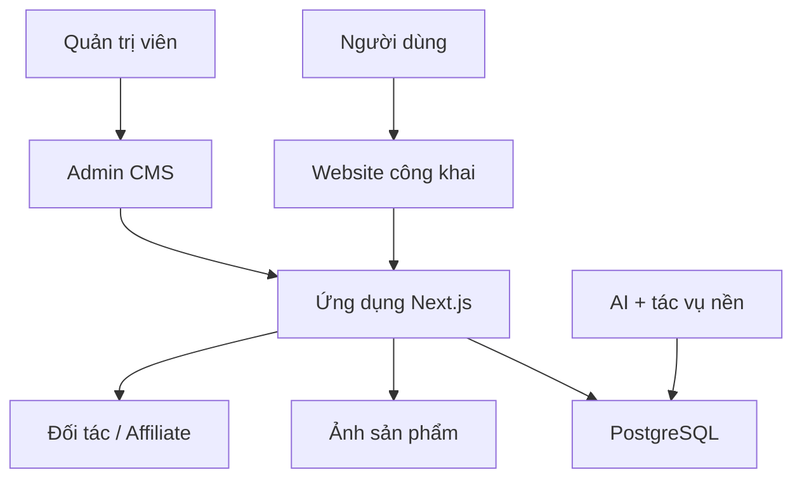

# KẾ HOẠCH TỔNG THỂ TRIỂN KHAI SANPHAMCHINHHANG.COM

**Phiên bản:** 1.1 — Bản chốt để bắt đầu triển khai  
**Ngày lập:** 12/09/2026  
**Chủ dự án:** Phan Văn Thuần  
**Đơn vị triển khai:** Công ty Cổ phần Thương mại Dịch vụ 30 NICE  
**Tên miền:** https://sanphamchinhhang.com  

## 0. Tóm tắt quyết định đã chốt

- Xây dựng nền tảng tìm kiếm, kiểm tra, so sánh và điều hướng mua sản phẩm chính hãng; không xây sàn thương mại điện tử trong MVP.
- Không nhập hàng, không kho, không giao hàng và không tích hợp thanh toán trong giai đoạn đầu.
- Doanh thu ban đầu đến từ affiliate; sau đó mở rộng lead, Brand Page, Verified Seller, quảng cáo tài trợ và API dữ liệu.
- Công nghệ chính: Next.js, TypeScript và PostgreSQL; phát triển trên localhost, quản lý bằng GitHub và triển khai lên Vercel.
- Hai ngành khởi động đề xuất: điện tử – công nghệ và gia dụng.
- **Codex/ChatGPT là đội xây dựng chính.**
- **Claude Code là đội kiểm định độc lập:** review code sâu, UI/UX, hiệu năng, logic và bảo mật.
- Model Codex mặc định: GPT-5.6 Terra – Medium; Sol – High chỉ dùng cho kiến trúc/lỗi khó; Luna dùng cho tác vụ nhỏ, lặp lại.
- GitHub là nguồn sự thật duy nhất; không để Codex và Claude Code tự do chỉnh cùng một branch.

---

## 1. Tầm nhìn và định vị

### Tầm nhìn

Xây dựng `sanphamchinhhang.com` thành nền tảng giúp người Việt:

> **Tìm kiếm → Kiểm tra → So sánh → Chọn nơi mua sản phẩm chính hãng.**

### Định vị

`sanphamchinhhang.com` không phải sàn thương mại điện tử và không trực tiếp ôm hàng. Nền tảng đóng vai trò lớp dữ liệu, nội dung, xác thực và điều hướng người mua đến thương hiệu, đại lý hoặc sàn thương mại điện tử uy tín.

### Nguyên tắc triển khai

- Không nhập hàng, không quản lý kho, không giao hàng.
- Không tích hợp thanh toán trong MVP.
- Tạo doanh thu sớm từ affiliate và lead.
- Chỉ xuất bản dữ liệu có nguồn và có bước kiểm duyệt.
- Không tạo hàng loạt nội dung AI chất lượng thấp.
- Thiết kế hệ thống để sau này mở rộng Verified Seller, API và ứng dụng di động.

---

## 2. Mục tiêu MVP trong 12 tuần

MVP phải đạt được 5 kết quả:

1. Website hoạt động ổn định trên tên miền thật.
2. Có từ 300–1.000 sản phẩm chất lượng thuộc 2 ngành thử nghiệm.
3. Người dùng tìm kiếm, xem sản phẩm, so sánh và bấm sang nơi mua được.
4. Quản trị viên nhập, duyệt, cập nhật và xuất bản dữ liệu dễ dàng.
5. Theo dõi được lượt tìm kiếm, lượt bấm affiliate và nhu cầu người dùng.

### Hai ngành triển khai đầu tiên

1. **Điện tử – công nghệ:** dễ chuẩn hóa model, thông số, bảo hành và nơi bán.
2. **Gia dụng:** giá trị đơn hàng khá, nhu cầu so sánh và tìm hàng chính hãng cao.

Mỹ phẩm, mẹ và bé, thiết bị ô tô sẽ mở sau khi quy trình dữ liệu của hai ngành đầu hoạt động ổn định.

---

## 3. Phạm vi chức năng MVP

### 3.1. Website dành cho người dùng

| Nhóm | Chức năng bắt buộc |
|---|---|
| Trang chủ | Ô tìm kiếm lớn; danh mục; thương hiệu nổi bật; sản phẩm được quan tâm; bài hướng dẫn |
| Tìm kiếm | Tìm theo tên, model, thương hiệu, SKU hoặc barcode; gợi ý khi nhập |
| Danh mục | Lọc theo thương hiệu, khoảng giá, thuộc tính kỹ thuật và trạng thái xác minh |
| Trang sản phẩm | Ảnh; mô tả; thông số; bảo hành; nguồn gốc; ưu/nhược điểm; cảnh báo; nguồn tham khảo |
| Nơi mua | Danh sách nơi bán; giá cập nhật; loại người bán; nút affiliate; thời điểm ghi nhận giá |
| So sánh | So sánh tối đa 4 sản phẩm theo thuộc tính cùng danh mục |
| Thương hiệu | Giới thiệu; website chính thức; chính sách bảo hành; danh sách sản phẩm |
| Kiểm tra | Nhập barcode/model/serial để tìm dữ liệu; chưa đủ căn cứ thì trả kết quả thận trọng |
| Nội dung | Review; hướng dẫn chọn mua; cách nhận biết rủi ro hàng giả; chính sách bảo hành |
| Phản hồi | Báo sai dữ liệu, đề nghị bổ sung sản phẩm hoặc nơi bán |

### 3.2. Trang quản trị

- Đăng nhập và phân quyền quản trị viên/biên tập viên/kiểm duyệt viên.
- CRUD danh mục, thương hiệu, sản phẩm, thuộc tính, người bán và nơi mua.
- Import sản phẩm bằng CSV/XLSX.
- Hàng đợi AI chuẩn hóa nội dung và thông số.
- Trạng thái nội dung: Nháp → Chờ duyệt → Đã duyệt → Đã xuất bản → Tạm ẩn.
- Lưu nguồn tham khảo cho từng trường dữ liệu quan trọng.
- Quản lý affiliate link và tham số chiến dịch.
- Nhật ký thay đổi dữ liệu.
- Dashboard lượt xem, tìm kiếm, outbound click và từ khóa không có kết quả.

### 3.3. Chưa làm trong MVP

- Giỏ hàng, đặt hàng, thanh toán, COD.
- Quản lý kho và vận chuyển.
- Seller tự đăng ký và tự xuất bản sản phẩm.
- Cấp chứng nhận chính hãng tự động.
- Ứng dụng mobile native.
- Thu thập dữ liệu trái điều khoản của website/sàn.
- Tuyên bố một sản phẩm là thật chỉ dựa trên giá hoặc ảnh do người dùng nhập.

---

## 4. Kiến trúc kỹ thuật đề xuất

### 4.1. Công nghệ

| Thành phần | Lựa chọn ban đầu |
|---|---|
| Frontend + Backend | Next.js App Router, TypeScript |
| Giao diện | Tailwind CSS + bộ component có thể tùy biến |
| Cơ sở dữ liệu | PostgreSQL |
| ORM | Prisma hoặc Drizzle; chốt một loại trước khi scaffold |
| Tìm kiếm MVP | PostgreSQL full-text + trigram |
| Tìm kiếm khi tăng trưởng | Meilisearch/Typesense/OpenSearch khi dữ liệu và traffic đủ lớn |
| Lưu ảnh | Cloudinary hoặc object storage tương thích S3 |
| Đăng nhập admin | Auth.js hoặc dịch vụ xác thực tương đương |
| Hàng đợi xử lý | Job table trong PostgreSQL ở MVP; nâng cấp queue chuyên dụng sau |
| Phân tích | GA4/Search Console + bảng sự kiện nội bộ cho affiliate click |
| Triển khai | GitHub + Vercel; PostgreSQL managed |
| Kiểm thử | Unit, integration và Playwright end-to-end |

### 4.2. Các khối hệ thống

### 4.3. Quy tắc kiến trúc

- Một monorepo trong giai đoạn MVP để giảm chi phí vận hành.
- Tách rõ khu vực public, admin, API, job và domain logic trong mã nguồn.
- Server-side render cho trang SEO quan trọng.
- Mọi affiliate click đi qua endpoint ghi nhận nội bộ trước khi chuyển hướng.
- Dữ liệu giá luôn kèm nguồn và thời điểm cập nhật.
- AI không được tự động xuất bản; kết quả phải vào hàng chờ duyệt.

---

## 5. Mô hình dữ liệu cốt lõi

### Các bảng chính

| Bảng | Vai trò |
|---|---|
| `categories` | Cây danh mục và bộ thuộc tính theo ngành |
| `brands` | Thương hiệu, website chính thức, bảo hành, trạng thái xác minh |
| `products` | Sản phẩm chuẩn/canonical product |
| `product_variants` | Phiên bản màu, dung lượng, kích thước hoặc model con |
| `attribute_definitions` | Định nghĩa thuộc tính của từng danh mục |
| `product_attribute_values` | Giá trị thông số sản phẩm |
| `sellers` | Hãng, đại lý, website hoặc gian hàng sàn |
| `offers` | Giá, URL mua, affiliate URL, tồn tại ghi nhận và thời điểm cập nhật |
| `sources` | Nguồn của dữ liệu, ngày truy cập và mức tin cậy |
| `product_source_links` | Liên kết dữ liệu sản phẩm với nguồn tham khảo |
| `articles` | Review và nội dung hướng dẫn |
| `comparisons` | Dữ liệu hoặc phiên so sánh sản phẩm |
| `outbound_clicks` | Sự kiện bấm sang nơi mua |
| `search_events` | Từ khóa, kết quả và từ khóa không có kết quả |
| `feedback_reports` | Báo sai hoặc đề nghị bổ sung |
| `ai_jobs` | Tác vụ AI, đầu vào, đầu ra, trạng thái duyệt |
| `audit_logs` | Nhật ký thay đổi dữ liệu quản trị |
| `users` / `roles` | Tài khoản và phân quyền CMS |

### Trạng thái xác minh

- `unverified`: mới nhập, chưa kiểm tra.
- `source_checked`: đã đối chiếu nguồn công khai đáng tin cậy.
- `brand_confirmed`: được thương hiệu/đơn vị có thẩm quyền xác nhận.
- `expired`: bằng chứng hoặc giấy tờ đã hết hiệu lực.
- `disputed`: dữ liệu đang có tranh chấp hoặc phản hồi cần xử lý.

Không dùng một badge “chính hãng” chung chung nếu chưa xác định rõ đối tượng được xác minh là **thương hiệu, người bán, giấy tờ hay sản phẩm**.

---

## 6. Quy trình dữ liệu và AI

### Luồng nhập sản phẩm

1. Biên tập viên nhập URL nguồn hoặc file CSV/XLSX.
2. Hệ thống tạo bản ghi nháp và lưu nguồn.
3. AI đề xuất tên chuẩn, slug, mô tả, nhóm thuộc tính và phát hiện dữ liệu thiếu/xung đột.
4. Biên tập viên kiểm tra thông số và nguồn.
5. Kiểm duyệt viên phê duyệt.
6. Hệ thống xuất bản và tạo metadata SEO/schema.
7. Job định kỳ đánh dấu giá/dữ liệu cũ để kiểm tra lại.

### Quy tắc dùng AI

- AI chỉ đề xuất, chuẩn hóa, phân loại, tóm tắt và phát hiện mâu thuẫn.
- Không để AI tự bịa giá, mã model, bảo hành, xuất xứ hoặc chứng nhận.
- Lưu model, prompt version, thời điểm chạy và người duyệt.
- Mỗi nội dung quan trọng phải truy ngược được về nguồn.
- Không sao chép nguyên văn nội dung thương mại của nguồn khác.

---

## 7. SEO và nội dung

### Cấu trúc URL

- `/danh-muc/[slug]`
- `/thuong-hieu/[slug]`
- `/san-pham/[slug]`
- `/so-sanh/[slug-hoac-id]`
- `/kiem-tra`
- `/review/[slug]`
- `/huong-dan/[slug]`
- `/noi-mua/[slug]` nếu nội dung đủ khác biệt và hữu ích

### Yêu cầu SEO kỹ thuật

- Canonical URL, sitemap chia nhóm, robots và breadcrumb.
- Structured data phù hợp; không khai báo rating/offer không có bằng chứng.
- Metadata riêng cho từng trang.
- Ảnh WebP/AVIF, lazy loading và kích thước cố định.
- Không index trang lọc rác, tìm kiếm nội bộ hoặc trang dữ liệu quá mỏng.
- Theo dõi Core Web Vitals, lỗi crawl và trang không được index.

### Cụm nội dung 90 ngày đầu

- Hướng dẫn chọn mua theo nhu cầu/ngân sách.
- So sánh các model trong cùng phân khúc.
- Cách kiểm tra model, barcode, serial và bảo hành.
- Phân biệt hàng phân phối chính thức, xách tay và bảo hành cửa hàng.
- Trang thương hiệu và trung tâm bảo hành có nguồn rõ ràng.

---

## 8. Đo lường và doanh thu

### Sự kiện bắt buộc

- `search_submitted`
- `search_no_result`
- `product_viewed`
- `compare_started`
- `offer_clicked`
- `feedback_submitted`
- `affiliate_redirected`

### KPI MVP

| Nhóm | KPI sau 12 tuần |
|---|---|
| Sản phẩm | 300–1.000 sản phẩm đã duyệt |
| Chất lượng | 100% sản phẩm có ít nhất một nguồn và ngày cập nhật |
| Nơi mua | Ít nhất 2 offer hợp lệ cho nhóm sản phẩm ưu tiên khi có dữ liệu |
| Kỹ thuật | Không có lỗi nghiêm trọng trong luồng tìm → xem → bấm mua |
| Hiệu năng | Trang chính đạt mức Core Web Vitals chấp nhận được trên mobile |
| Dữ liệu | Ghi nhận đủ tìm kiếm, trang xem và outbound click |
| Doanh thu | Có click affiliate thực; đơn/hoa hồng là KPI thử nghiệm, chưa cam kết con số |

### Nguồn thu theo thứ tự

1. Affiliate.
2. Lead cho ngành giá trị cao.
3. Trang thương hiệu/gian hàng chính thức.
4. Verified Seller có quy trình thẩm định.
5. Sponsored placement được gắn nhãn rõ ràng.
6. API dữ liệu ở giai đoạn tăng trưởng.

---

## 9. Lộ trình triển khai 12 tuần

### Giai đoạn 0 — Khởi động (Tuần 1)

**Công việc**

- Chốt logo tạm, bảng màu, font và thông điệp chính.
- Chốt 2 ngành và 20 thương hiệu thử nghiệm.
- Tạo GitHub repository và quy tắc branch/PR.
- Viết `README.md`, `AGENTS.md`, `CLAUDE.md`, coding conventions và Definition of Done.
- Khởi tạo backlog bằng GitHub Issues.
- Chốt ORM, dịch vụ PostgreSQL, ảnh và xác thực.

**Bàn giao:** Project brief, backlog, kiến trúc, repo có thể chạy localhost.

### Giai đoạn 1 — Nền tảng kỹ thuật (Tuần 2–3)

**Công việc**

- Scaffold ứng dụng, cấu hình môi trường và CI.
- Thiết kế schema/migration/seed.
- Xây đăng nhập và phân quyền admin.
- Xây layout public/admin và design tokens.
- Thiết lập test, logging và error handling.

**Bàn giao:** Có thể đăng nhập admin, database hoạt động, deploy preview tự động.

### Giai đoạn 2 — CMS dữ liệu (Tuần 4–5)

**Công việc**

- CRUD danh mục, thương hiệu, sản phẩm, thuộc tính, seller và offer.
- Upload ảnh.
- Import CSV/XLSX và kiểm tra lỗi theo dòng.
- Workflow nháp/duyệt/xuất bản.
- Nguồn dữ liệu và audit log.

**Bàn giao:** Nhân sự không cần sửa code vẫn nhập và xuất bản sản phẩm được.

### Giai đoạn 3 — Website công khai (Tuần 6–7)

**Công việc**

- Trang chủ, danh mục, thương hiệu và chi tiết sản phẩm.
- Tìm kiếm, gợi ý, bộ lọc và phân trang.
- Trang so sánh sản phẩm.
- Nơi mua và affiliate redirect tracking.
- Responsive mobile-first.

**Bàn giao:** Hoàn chỉnh hành trình tìm → xem → so sánh → bấm mua.

### Giai đoạn 4 — AI và vận hành nội dung (Tuần 8–9)

**Công việc**

- AI job tạo nháp, chuẩn hóa thông số và kiểm tra dữ liệu thiếu.
- Mẫu prompt có version.
- Màn hình duyệt kết quả AI và hiển thị khác biệt.
- Nhập 100 sản phẩm mẫu, sửa quy trình rồi mở rộng 300–1.000 sản phẩm.

**Bàn giao:** AI giảm thao tác nhập liệu nhưng không tự xuất bản.

### Giai đoạn 5 — SEO, phân tích và bảo mật (Tuần 10)

**Công việc**

- Metadata, sitemap, robots, canonical và structured data.
- GA4, Search Console và event dashboard.
- Rate limit, validation, chống spam và backup.
- Chính sách bảo mật, điều khoản, miễn trừ và công bố affiliate.

**Bàn giao:** Website sẵn sàng cho công cụ tìm kiếm và đo lường.

### Giai đoạn 6 — QA và ra mắt (Tuần 11–12)

**Công việc**

- Test chức năng, responsive, SEO, quyền admin và dữ liệu.
- Kiểm tra link ngoài/affiliate và lỗi 404/500.
- Kiểm thử tải ở mức MVP.
- Kết nối domain, SSL, email hệ thống và giám sát.
- Soft launch, theo dõi 7 ngày, sửa lỗi rồi public launch.

**Bàn giao:** Bản production, tài liệu vận hành, checklist backup/restore.

---

## 10. Phối hợp Codex và Claude Code — phương án đã chốt

Codex/ChatGPT trực tiếp xây dựng hệ thống. Claude Code không phải đội code song song mặc định mà là lớp kiểm định độc lập sau mỗi module hoặc Pull Request. Chỉ khi Codex giao rõ một task độc lập thì Claude Code mới chỉnh sửa code.

### Vai trò đề xuất

| Bên | Trách nhiệm chính |
|---|---|
| Anh Thuần | Chốt nghiệp vụ, danh mục, thương hiệu, giao diện và tiêu chí dữ liệu |
| ChatGPT | Phân tích nghiệp vụ, lập PRD, chia Sprint, viết tiêu chí nghiệm thu và hỗ trợ quyết định |
| Codex | Kiến trúc, schema, frontend, backend, admin, integration, test, sửa lỗi và quản lý code chính |
| Claude Code | Review độc lập về kiến trúc, code sâu, UI/UX, logic, hiệu năng, dependency và bảo mật |
| GitHub | Nguồn sự thật duy nhất: Issue, branch, PR, CI và lịch sử quyết định |

### Quy trình cho mỗi task

1. Tạo GitHub Issue có mục tiêu, phạm vi, file dự kiến và Acceptance Criteria.
2. Codex là chủ task xây dựng trừ khi issue ghi rõ người thực hiện khác.
3. Tạo branch theo mẫu `feat/issue-123-product-search`.
4. AI chỉ sửa trong phạm vi issue; không tự đổi kiến trúc chung.
5. Codex chạy lint, typecheck, unit/integration/e2e liên quan.
6. Codex mở Pull Request kèm ảnh, video hoặc log test.
7. Claude Code review nhưng chưa tự sửa; tạo báo cáo Critical/High/Medium/Low kèm file, nguyên nhân và cách khắc phục.
8. Codex xác minh phát hiện, sửa các lỗi hợp lệ và bổ sung regression test.
9. Claude Code kiểm tra lại các lỗi Critical/High.
10. Anh duyệt nghiệp vụ/giao diện trước khi merge.
11. Merge vào `develop`; chỉ release đã QA mới vào `main`.

### Checklist review bảo mật của Claude Code

- Authentication, session và password policy.
- Authorization theo từng API/resource; chống IDOR/BOLA.
- Validation đầu vào, SQL injection, XSS và command injection.
- CSRF, CORS, SSRF và open redirect.
- Upload ảnh/file, MIME, kích thước và đường dẫn.
- Lộ secret, log nhạy cảm và biến môi trường.
- Rate limiting, brute force, spam và abuse affiliate redirect.
- Dependency vulnerabilities và cấu hình production.
- Phân quyền trang admin, audit log và migration database.
- Không coi kết quả AI là chứng nhận bảo mật tuyệt đối; vẫn chạy công cụ kiểm thử tự động và test thực tế.

### File điều phối bắt buộc

- `README.md`: chạy dự án và tổng quan.
- `AGENTS.md`: quy tắc làm việc dành cho Codex.
- `CLAUDE.md`: quy tắc làm việc dành cho Claude Code.
- `docs/ARCHITECTURE.md`: kiến trúc và quyết định kỹ thuật.
- `docs/DATA_GOVERNANCE.md`: tiêu chuẩn nguồn, xác minh và AI.
- `docs/ROADMAP.md`: roadmap và trạng thái.
- `.env.example`: tên biến môi trường, tuyệt đối không chứa secret.

### Quy tắc chống xung đột

- Không dùng chung working tree cho hai AI cùng lúc.
- Mỗi AI có branch/worktree riêng.
- Không force-push lên branch của AI khác.
- Migration database chỉ do một task/PR sở hữu tại một thời điểm.
- Thay đổi schema/API phải cập nhật tài liệu và type dùng chung.
- Không merge khi CI đỏ hoặc migration chưa được kiểm tra trên database thử nghiệm.
- Secret chỉ lưu trong môi trường deploy/GitHub Secrets, không đưa vào prompt hoặc commit.

---

## 11. Backlog ưu tiên để bắt đầu code

### Epic A — Foundation

- A01: Khởi tạo repo và ứng dụng.
- A02: CI lint/typecheck/test/build.
- A03: Environment validation và `.env.example`.
- A04: Design system cơ bản và responsive shell.
- A05: Error handling, logging và health check.

### Epic B — Identity & Admin

- B01: Đăng nhập admin.
- B02: Role và permission.
- B03: Admin layout/navigation.
- B04: Audit log.

### Epic C — Product Data

- C01: Category schema và category attribute definitions.
- C02: Brand CRUD.
- C03: Product/variant CRUD.
- C04: Seller/offer CRUD.
- C05: Source/evidence management.
- C06: Workflow duyệt và xuất bản.
- C07: CSV/XLSX import.

### Epic D — Public Experience

- D01: Homepage.
- D02: Category listing/filtering.
- D03: Product detail.
- D04: Brand page.
- D05: Search/autocomplete.
- D06: Comparison.
- D07: Check by barcode/model.
- D08: Feedback form.

### Epic E — Monetization & Analytics

- E01: Affiliate link configuration.
- E02: Safe redirect và outbound click events.
- E03: Search analytics/no-result report.
- E04: GA4/Search Console.

### Epic F — AI Content Operations

- F01: AI provider adapter.
- F02: Job queue và retry.
- F03: Product normalization prompt.
- F04: Draft generation và diff review.
- F05: Source conflict warning.

### Epic G — SEO, Legal & Launch

- G01: Metadata/canonical/sitemap/robots.
- G02: Structured data.
- G03: Legal pages và affiliate disclosure.
- G04: Security/rate limiting/backups.
- G05: E2E launch checklist.

---

## 12. Definition of Done

Một task chỉ được coi là hoàn tất khi:

- Đạt toàn bộ Acceptance Criteria.
- Không còn lỗi TypeScript, lint hoặc test liên quan.
- Có test cho logic quan trọng hoặc lý do rõ ràng nếu không cần test.
- Giao diện kiểm tra được trên mobile và desktop nếu task có UI.
- Không chứa secret, dữ liệu cá nhân hoặc nội dung không có quyền sử dụng.
- Có migration/rollback note nếu thay đổi database.
- Cập nhật tài liệu nếu thay đổi API, schema hoặc quy trình.
- PR được review và CI chạy thành công.

---

## 13. Rủi ro và biện pháp kiểm soát

| Rủi ro | Biện pháp |
|---|---|
| Dữ liệu sản phẩm sai/cũ | Nguồn + ngày cập nhật + workflow duyệt + cảnh báo dữ liệu cũ |
| AI bịa thông tin | Không auto-publish; validate field; lưu nguồn; diff review |
| Nội dung mỏng, SEO kém | Chỉ index trang đủ dữ liệu; nội dung gốc; công cụ so sánh hữu ích |
| Phụ thuộc một affiliate network | Chuẩn hóa seller/offer; hỗ trợ nhiều network và link trực tiếp |
| Scraping vi phạm điều khoản | Ưu tiên feed/API/affiliate data và nguồn được phép; kiểm tra điều khoản |
| Hai AI sửa chồng chéo | Issue owner, branch/worktree riêng, PR review chéo |
| Chi phí hạ tầng tăng | PostgreSQL search ở MVP; cache; tối ưu ảnh; chỉ tách service khi có số liệu |
| Khiếu nại về badge chính hãng | Định nghĩa mức xác minh; bằng chứng; ngày hết hạn; quy trình gỡ/tranh chấp |

---

## 14. Điều kiện chuyển sang Phase 2

Chỉ mở rộng Verified Seller, Brand Portal và lead marketplace khi:

- MVP ổn định ít nhất 30 ngày.
- Có dữ liệu hành vi thật từ tìm kiếm và outbound click.
- Quy trình cập nhật sản phẩm/giá vận hành được.
- Có ít nhất 3–5 thương hiệu hoặc đại lý muốn hợp tác thử nghiệm.
- Có quy trình thẩm định, khiếu nại và thu hồi badge bằng văn bản.

Chỉ cân nhắc gọi vốn khi có ít nhất một trong các tín hiệu: traffic tăng đều, affiliate/lead revenue, đối tác trả phí, dữ liệu độc quyền hoặc khả năng giữ chân người dùng rõ ràng.

---

## 15. Quyết định cần anh Thuần chốt trước khi bắt đầu Sprint 1

1. Logo hiện có hay thiết kế nhận diện mới.
2. Hai ngành đầu tiên có giữ **điện tử – công nghệ** và **gia dụng** hay thay đổi.
3. 20 thương hiệu đầu tiên.
4. GitHub repository mới và quyền truy cập deploy.
5. Nguồn affiliate đầu tiên anh đã/định đăng ký.
6. Ngân sách hạ tầng tối đa mỗi tháng trong 3 tháng đầu.
7. Có sử dụng lại hạ tầng CMS hiện tại của 30 NICE hay tạo hệ thống độc lập hoàn toàn.

---

## 16. Kế hoạch bắt đầu triển khai

### Bước 1 — Anh Thuần chuẩn bị

- Tạo GitHub repository riêng tư tên `sanphamchinhhang` hoặc xác nhận repository đã có.
- Mở repository đó trong Codex Desktop.
- Xác nhận Codex có thể tạo branch, commit và push.
- Cung cấp logo hiện có; nếu chưa có sẽ dùng logo chữ tạm thời.
- Chốt hai ngành đầu hoặc đồng ý dùng điện tử – công nghệ và gia dụng.
- Gửi danh sách 10–20 thương hiệu ưu tiên; nếu chưa có, Codex sẽ đề xuất để anh duyệt.
- Chưa cần mua dịch vụ trả phí hoặc cung cấp secret ở bước này.

### Bước 2 — Codex thực hiện Sprint 0

**Thời lượng mục tiêu:** 1–2 ngày làm việc tập trung.

1. Kiểm tra repository và môi trường hiện tại.
2. Tạo `README.md`, `AGENTS.md`, `CLAUDE.md` và thư mục `docs/`.
3. Tạo PRD v1, sitemap, kiến trúc, schema v1 và quy chuẩn dữ liệu.
4. Scaffold Next.js + TypeScript + Tailwind CSS.
5. Thiết lập lint, typecheck, test, build và CI.
6. Tạo `.env.example` không chứa khóa thật.
7. Tạo dữ liệu giả cho danh mục, thương hiệu, sản phẩm và nơi mua.
8. Tạo Pull Request đầu tiên và hướng dẫn chạy localhost.

**Điều kiện nghiệm thu Sprint 0**

- Clone, cài dependency và chạy localhost thành công.
- Lint, typecheck, test và build đều thành công.
- Có cấu trúc thư mục, quy tắc làm việc và tài liệu kiến trúc.
- Không có secret trong repository.
- Có dữ liệu giả đủ để bắt đầu dựng giao diện.

### Bước 3 — Codex thực hiện Sprint 1

**Mục tiêu:** Tạo bản giao diện có thể bấm xem trên localhost trước khi làm backend đầy đủ.

- Trang chủ.
- Trang danh mục và bộ lọc mẫu.
- Trang thương hiệu.
- Trang chi tiết sản phẩm.
- Trang so sánh tối đa 4 sản phẩm.
- Khung đăng nhập và dashboard quản trị.
- Responsive cho mobile và desktop.

**Mốc duyệt số 1:** Anh duyệt nhận diện, bố cục, trải nghiệm tìm kiếm và trang sản phẩm.

### Bước 4 — Claude Code review độc lập

- Review toàn bộ Pull Request Sprint 0–1 nhưng chưa tự sửa code.
- Kiểm tra kiến trúc, chất lượng code, UI/UX, responsive, accessibility và hiệu năng.
- Rà soát các nguy cơ bảo mật có thể xuất hiện từ nền móng dự án.
- Xuất báo cáo Critical/High/Medium/Low.
- Codex sửa phát hiện hợp lệ; Claude Code kiểm tra lại lỗi Critical/High.

### Bước 5 — Sprint 2 trở đi

- Xây database và migration thật.
- Xây CMS sản phẩm, thương hiệu, seller, offer và nguồn dữ liệu.
- Xây workflow nháp, duyệt và xuất bản.
- Nhập 100 sản phẩm thử nghiệm.
- Hoàn thiện tìm kiếm, so sánh và affiliate tracking.
- Mở rộng lên 300–1.000 sản phẩm sau khi quy trình dữ liệu ổn định.

### Việc đầu tiên để kích hoạt dự án

Sau khi repository được tạo và mở trong Codex Desktop, sử dụng yêu cầu khởi động sau:

> Đọc toàn bộ `SANPHAMCHINHHANG_MASTER_IMPLEMENTATION_PLAN.md`. Hãy thực hiện Sprint 0, bắt đầu bằng việc kiểm tra repository, lập kế hoạch công việc, tạo bộ tài liệu nền móng và scaffold dự án chạy localhost. Chưa xây chức năng ngoài phạm vi Sprint 0. Không đưa secret vào repository. Hoàn tất phải chạy lint, typecheck, test và build, sau đó báo cáo file đã tạo, kết quả kiểm thử và các quyết định cần tôi duyệt.
